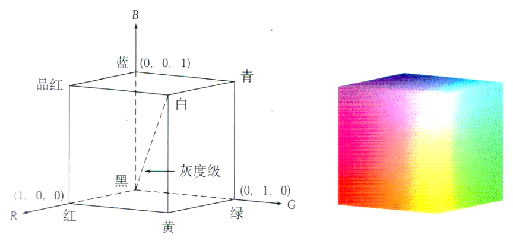
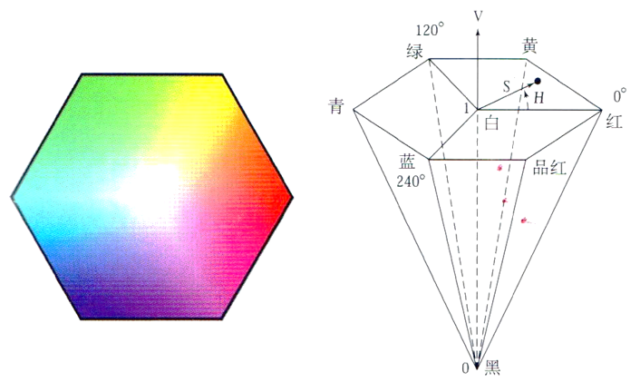
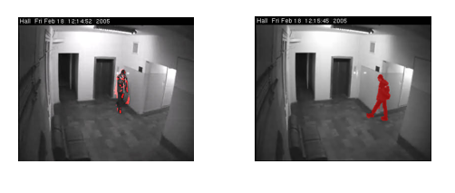
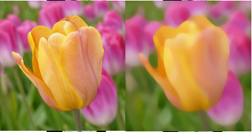
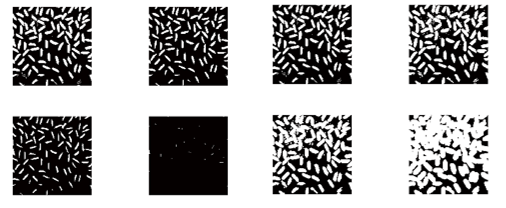
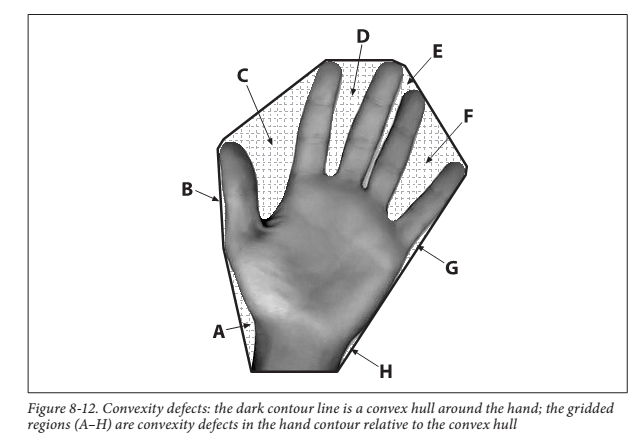
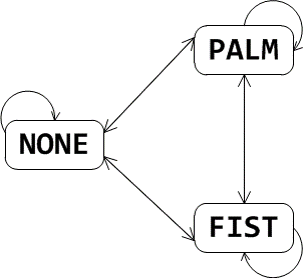
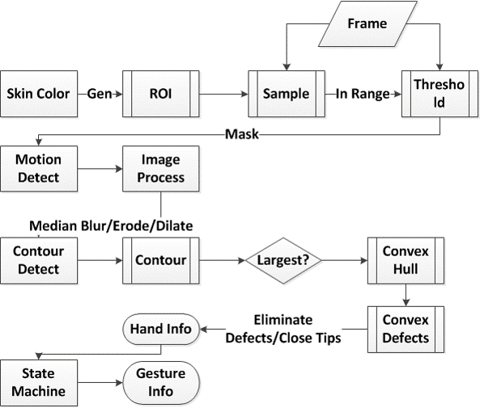

#  libcvgesture Brief Documention

| Contribution |                  Author                  |
| :----------: | :--------------------------------------: |
| Development  |   Zak Penn - microsmadiopenn@gmail.com   |
|   Document   | Ziseon - [emengjzs@163.com](mailto://emengjzs@163.com) |

## 1. 总览

libcvgesture  是一个基于OpenCV的手势识别程序，可以识别手张开、收紧、左挥、右挥的手势。

## 2. 项目配置说明

请参考https://github.com/mspenn/libcvgesture。

**Warning**：

- **Visual Studio 2015 不保证能够正确运行**。[下载地址](https://www.microsoft.com/zh-cn/download/confirmation.aspx?id=48144)

## 3. 识别步骤

不管手势识别算法如何，在处理手势识别这一过程通常包含以下的一些步骤：

### 手势采样

​       为了减少分离手势图像带来的不确定性和复杂性，程序使用了一些折中的方法，在程序启动时先在指定区域内收集用户的手型信息，即先对手势进行采样，作为样本，借助于样本提供的信息更有效地在用户使用手势时判断出手势的位置和区域。为了提高采样的质量，还会通过摄取多个手的帧图像，每个图像都进行一次处理，综合多个图像的采样结果作为建模基准。

### 手势建模

​       是指从原始的图像信息建立一个可量化、可分析的模型，以便在后续过程直接根据手势的建模信息进行判断和识别。实际上建模过程贯穿在手势采样、手势分离和手势跟踪的步骤上。例如，手势采样是从颜色空间上进行建模，而手势跟踪则是对手势动作轨迹进行建模。后续的任务中也基本是使用模型并建立模型的过程。

​       手势的采样基于肤色对手进行建模和判断。对颜色的建模则需要考虑使用的颜色空间。颜色空间是对色彩的一种描述方式，即使用一组值（通常使用三个、四个值或者颜色成分）表示颜色方法的抽象数学模型。常用的颜色空间如RGB、HSV、CMYK等。程序使用了基于HSV颜色空间的建模方法。考虑一下同一只手在摄像环境下的颜色变化，手本身的肤色是不变的，但在光线、角度的影响下，手在摄像中的颜色可能会发生亮度变化，因此我们希望能够把握的是**同一个色调**在不同亮度和饱和度下的不同情况。RGB描述的是红绿蓝三色光的数值，例如白色是(255, 255, 255)，黑是(0, 0, 0)，可以猜想到灰色的编码是是两者的中间值，灰度的亮度变化会同时改变描述颜色的三个数值，实际上灰度因子处于RGB空间的一个斜向平面，改变颜色的灰度将会同时改变RGB的三个值。因此以RGB颜色空间作为手势颜色建模是不适合的。而HSV是关于色相, 饱和度和明度的描述，故适合于手势在光线因素影响下的判断。

 

图1 RGB颜色空间

 

图2 HSV颜色空间

### 手势检测与跟踪

​       在程序对手的肤色进行采样后，用户即可以开始进行手势操作。由于在用户进行手势动作的过程中，手势的部分通常混于所在的环境或背景中，所以需要将手势的部分和其他无关部分分离开来，便于后续处理和分析。这是手势识别的前提和基础。为了进一步提高手势部分提取的质量，本程序同时使用了两种建模方法对手势进行定位、跟踪和提取。

​       一是使用基于表观特征的检测分离出手势图像，即使用之前采样步骤中的颜色建模。鉴于肤色的特征能够有效判别出手和背景的差异，我们可以根据颜色作为分离的标准。使用HSV对手进行建模后，根据模型信息对图像进行分离，例如得到肤色的基准值后，设置一个阈值，对图像过滤掉超过这个阈值的像素点，表明这些点的颜色和样本颜色相差过大，可认为这些点不是属于手部分的图像。过滤后基本可以得到只有手势部分和脸部分图像。

​       二是使用基于物体移动的跟踪捕获分析模型得到手势图像。由于手势是动态的，除了能够从静态图像中建立模型之外，还需要在一段连续的时间段中分析出移动的物体和动作的轨迹，也即对摄像的每个捕捉帧（为了减少计算量，也可每次间隔一定的时间进行图像捕捉），建立关于时间的手势序列。

​      改进的混合高斯模型是一个比较有效地对移动目标进行跟踪的模型方法。在背景图像建模方法中，混合高斯模型(gaussian mixture models，GMM)是一种常用的方法。该方法由Stauffer和Grimson提出，用多个高斯模型来表示像素值的变化，对复杂背景模拟效果较好，可以抑制动态背景对目标检测的影响，特别是存在小幅度周期运动的背景， 比如喷泉、摇动的树木、飘扬的旗帜以及雨雪天气等情况；其缺点在于当背景变化复杂时，特别是背景变化周期长、规律性较小时，检测结果会出现“误检” 和“空洞”现象，主要原因是GMM 存在更新速度慢，光照变化敏感等不足。

图3 动态目标检测常用于监控系统中

​       改进的混合高斯模型同样使用K个高斯（正态）模型来表征图像中各个像素点的特征，不同的是，在获得一帧新的图像后，更新混合高斯模型，采用匹配的方法来判断某像素点是否是背景点。对视频图像中的每一个像素，用K个高斯模型表示某一像素点在某个时间的状态。当下一帧到来时，将当前帧各点的像素值与K个高斯分布进行匹配，判断该值是否超出高斯分布描述的置信度。若未超出，则表明像素值在分布的置信区间内，更新高斯分布的参数，对每一个高斯分布$N_i$的每一个参数$x_{ij}$，包括（权重、均值和方差），都使用平滑更新的公式得到新的参数。即

$$
x_{ij}(t) = (1- \alpha)·x_{ij}(t-1) + \alpha ·W_j ,        x_{ij} ∈ \{w_i, \mu_i, \sigma_i^2\}
$$

​       $\alpha$称为学习率，也即平滑参数，$ \alpha$越小表明新的参数的值受之前的值的影响越大。$t$即时间序列， $W$依据参数$x$的不同而不同。如果超出，则建立一个新的高斯模型， 同时去掉最不可能是背景模型的高斯分布。其他高斯分布均值和方差不变，但权值按上式更新。

​       每个像素的R、G、B三个通道像素值的变化分别由一个混合高斯模型分布来刻画。这样的好处在于，同一个像素位置处可以呈现多个模态的像素值变化（例如水波纹，晃动的叶子等）。每个像素建立混合高斯模型时，只有一个或者几个高斯分布代表背景，其他的代表前景。由于背景出现的时间一般较长，权重较大，所以高斯混合模型中代表背景的高斯分布是那些权重较大的分布。因此，选择代表背景模型的高斯分时，先将高斯分布进行排列，最有可能成为高斯背景的排列在前，然后取前B个分布作为高斯分布的背景模型。选取B个高斯模型后，将当前帧像素值与已选取背景分别进行匹配，若与背景模型不匹配，则判定该像素点为前景点(即运动目标)，否则为背景点。

​       关于高斯混合模型的更详细的内容，可以搜寻有关**Improved Gaussian Mixture Model for Moving Object Detection**的专术文献。

​       结合肤色和动态区域，我们就能更好地将前景和背景分离，得到手势的图像。

### 手势处理

​       为了让手的轮廓更加清晰、平滑、完整，我们可以通过一些图像处理方法处理手势图像。相当于对数据进行预处理和转换。

1. 使用中值滤波器降噪。也即使用箱中位数光滑方法处理图像。设定桶的大小，将数据依次安放在不同的桶中，最后取每个桶的中位数作为桶中所有数据作为归约后的数据。它对于斑点噪声和椒盐噪声来说尤其有用。保存边缘的特性使它在不希望出现边缘模糊的场合也很有用。

   

   图4 通过中值降噪后，可以得到不受干扰的边界区域

2. 进行形态学操作,腐蚀与膨胀( Erosion 与 Dilation )。为了使得手的区域更完整，我们希望尽可能地使图像中手的色块区域连接在一起，使之形成没有空隙的轮廓图像。,腐蚀可以将较小的异常色素块被其他色素快“吞并”，从而去除噪点。膨胀可以将较大的，和近邻色块相似的色素块进行扩散，从而合并相同的色块点。这样，通过两个操作，我们可以得到更加完整的手势图形。腐蚀与膨胀的详细内容可以参考[这里](http://www.opencv.org.cn/opencvdoc/2.3.2/html/doc/tutorials/imgproc/erosion_dilatation/erosion_dilatation.html)。

   

   图5 左边是腐蚀，右边是膨胀

3. 轮廓凸包，由于手型是一个凹不规则图形，手指之间的间隙不利于我们对手指伸出数进行识别。一个较为简单的方法是对手型轮廓计算其凸包，通过形成凸包的顶点数间接判断手指伸出的个数（因为各个相邻手指的长度都不一致）。

   

   图6 凸包和顶点

### 手势分析和识别

​       最后，序列的起始点和结束点通常代表着进行手势动作的开始和结束点，对于手势和手势之间的分割，以及手势类型的判断，可以建立一个简单的有限状态机来处理。如下图所示，每一个状态（即点），表示手的一个静止状态，如张开、紧握（通过上述的凸包处理识别伸开的手指数目）。而当手的静止状态发生改变时，根据状态机的转向（即边）变换到另一个状态。不同的边即代表为不同的手势类型。例如。当手从张开变换到紧握手势时，代表使用者进行了握紧的手势动作。编码每一个边的手势即可完成动态手势的识别。

。

图7 State Machine

## 总结

​       总结以上的处理流程，流程图如下图所示。

图8 处理流程图
